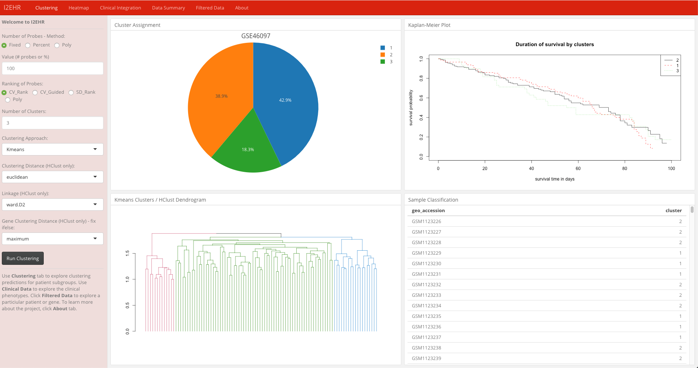
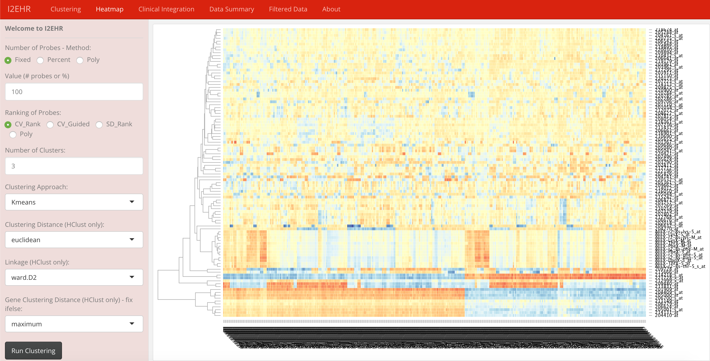
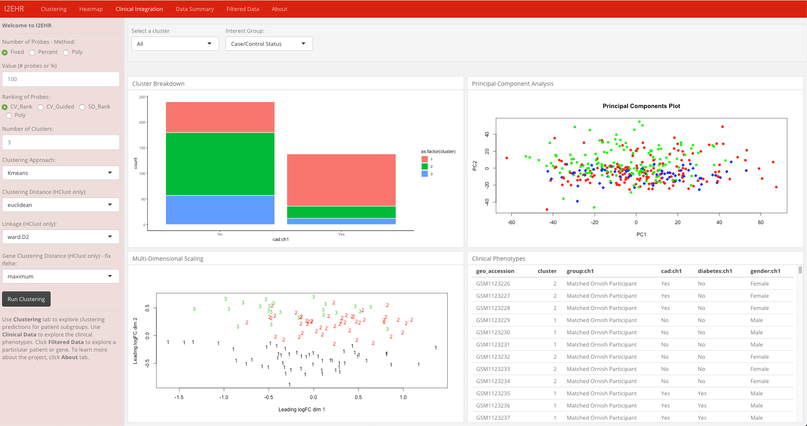
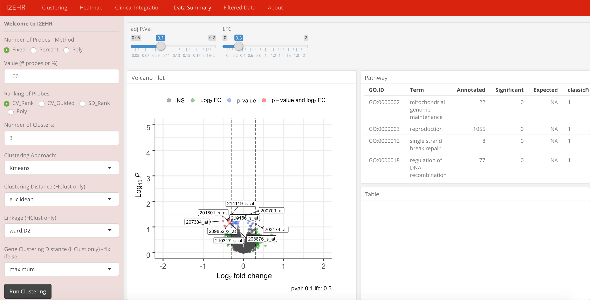

# Interactive Integrated Electronic Health Records (I2EHR)

This is the R Shiny based Interactive Integrated Electronic Health Records (I2EHR). This app integrates clinical and genomic data to identify patient subgroups and biomarkers related to disease. 

This application was originally created as a deliverable for my MSc in Biomedical Genomics. The original app used data from Synthea, a synthetic patient generator (https://github.com/synthetichealth/synthea), and microarray samples from the Gene Expression Omnibus (GEO) to create a biobank consisting of artificial patients linked to real genomic samples. 

The microarray CEL files are used to construct a R <code>ExpressionSet</code> object which also contained patient clinical observations that were used in lieu of Synthea. The decision to remove Synthea was because I wanted to focus on improving analytical power with machine learning and improved interactivity. This version of the I2EHR app was constructed using R packages <code>flexdashboard</code> and <code>Shiny</code>. The analyses were performed many R packages which include <code>multiclust</code>, <code>affy</code> and <code>topGO</code>. 

I will discussed the application by each of the 5 tabs. Namely these are: *Clustering, Heatmap, Clinical Integration, Data Summary, Filtered Data* and *About*. 

**Clustering**

This tab uses expression data to cluster samples. 

**Heatmap**

The heatmap tab contains a visualisation of a heatmap for each sample and probe. The heatmap is interactive and hover can be used to indicates the sample and probe. Scaling is column-based.

**Clinical Integration**

The Clinical Integration tab provides further insight into the cluster assignment. Cluster Breakdown is a stacked histogram for a clinical measurement chosen by the user. The colour indicates the colour and can be used to identify if a cluster is associated with a clinical phenotype. Principal Component Analysis and MultiDimensional Scaling represent group relationships and separation.  The Clinical Phenotypes tables show cluster assignment and clinical info for each sample.

**Filtered Data**

The Filtered Data tab allows you to view visualisations related to a certain sample or probe. If sample is selected, a histogram will be generated of the expression distribution by either case/control status or cluster assignment. If sample is selected, a t-test is performed for expression change from baseline to 1 year. A slope plot of expression change is also created which includes all samples but highlights the sample of interest.

**Data Summary**

The Data Summary tab allows you to visualise the significant genes found from the expression data. The thresholds for p and log2FC can be changed using radio buttons which will be represented in the volcano plot axis lines. The parameter thresholds will also be used to recalculate the pathways of greatest significance. 

